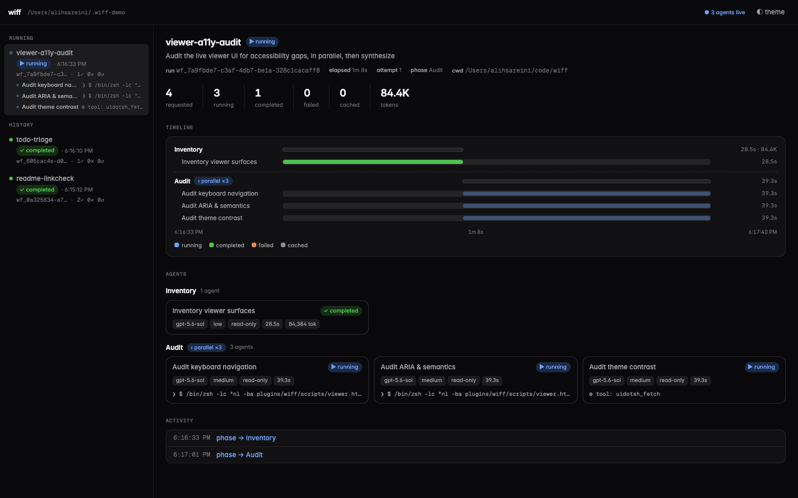
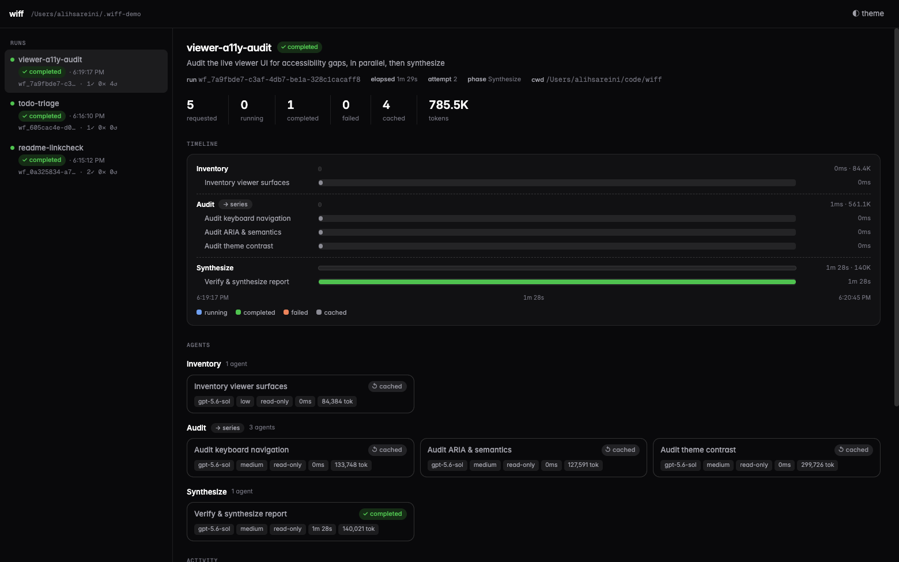
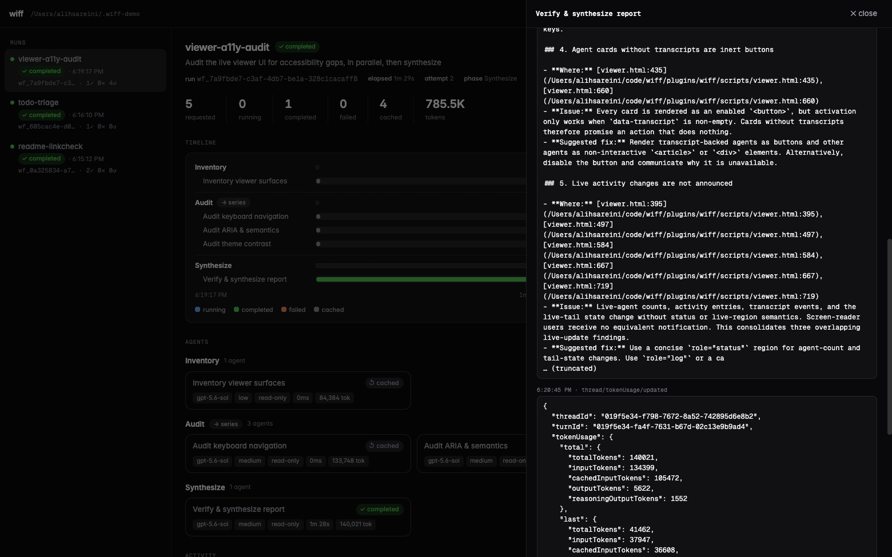

# wiff

**Harness-agnostic, deterministic, resumable multi-agent workflows — written as plain JavaScript. Like `wf`, but wiff.**

[](https://www.npmjs.com/package/@xxxoooxoxo/wiff) [](https://registry.modelcontextprotocol.io/v0/servers?search=io.github.xxxoooxoxo/wiff)  

Fan a task out to a fleet of agents with a small script instead of a prayer. You write ordinary JavaScript with `agent()`, `parallel()`, and `pipeline()`; the runtime executes it in the background, journals every step, and — when a run dies halfway through — resumes it without re-paying for a single completed agent. The engine is a plain MCP server with durable on-disk state, so the same run can be started, watched, resumed, or cancelled from **any** MCP client — Codex, Claude Code, Cursor, or a cron job — while each child runs on Codex, Claude, or Cursor.

<picture>
  <source media="(prefers-color-scheme: light)" srcset="docs/screenshots/run-light.png">
  
</picture>

```js
export const meta = {
  name: "audit",
  description: "Audit files in parallel, fix confirmed issues in isolation",
  phases: [{ title: "Audit" }, { title: "Fix" }],
};

phase("Audit");
const findings = await parallel(
  args.files.map((file) => () =>
    agent(`Audit ${file} for auth bugs`, {
      key: `audit:${file}`,          // stable key → free replay on resume
      sandbox: "read-only",
      schema: findingSchema,          // structured JSON output
    }),
  ),
);

phase("Fix");
return await parallel(
  findings.filter((f) => f.real).map((f) => () =>
    agent(`Fix: ${f.summary}`, {
      key: `fix:${f.file}`,
      agentType: "surgeon",           // persona from .codex/agents/surgeon.md
      isolation: "worktree",          // own git worktree — parallel writes can't collide
      sandbox: "workspace-write",
    }),
  ),
);
```

## Why

**There is no harness-agnostic workflow orchestration system.** Every coding harness has some
multi-agent story — Claude Code has its Workflow tool, Codex has subagents, Cursor has its own
agents — but each one is welded to its harness: its runs live and die with that app, its state is
invisible to everything else, and none of them can be driven from anywhere but their own chat
window. wiff pulls orchestration out of the harness: the engine is a plain MCP server with durable
on-disk state, so **any** MCP client — Codex, Claude Code, Cursor, a cron job — can start, watch,
resume, or cancel the same runs, and the orchestration itself is a script rather than a
conversation.

Ad-hoc multi-agent orchestration ("spawn some subagents for this") is also great until the run is
40 agents deep and something dies. Workflows-as-code give you:

- **Determinism** — the orchestration is a script, not vibes. No time, randomness, filesystem, or network inside workflow code; agents do the external work.
- **Resume, not retry** — every agent call is journaled with a stable key and an input hash. Kill the host, edit the script, resume the run: unchanged completed agents replay from cache instantly and for free. Agents that were interrupted **mid-turn** re-run with a digest of their previous attempt's transcript injected ("here's what you already did — continue"), and worktree agents inherit their partial checkout instead of starting over.

  

  That screenshot is the feature: the host was killed mid-synthesis, and on resume the four finished agents came back from the journal in 0ms — only the interrupted one re-ran.
- **Fail-hard semantics** — a rejected agent fails the workflow loudly (`parallelSettled()` is the explicit opt-out). No silent `null`s masquerading as success.
- **Isolation where it matters** — `isolation: "worktree"` gives each writing agent a fresh detached git worktree. Clean ones vanish; dirty ones are kept and listed on the run for you to inspect or merge.
- **Personas** — `agentType: "reviewer"` injects a markdown persona as the child's developer instructions, with frontmatter defaults for model/effort/sandbox.

## Install

**Codex** (plugin: MCP tools + the `$workflow` authoring skill):

```sh
codex plugin marketplace add https://github.com/xxxoooxoxo/wiff.git
codex plugin add wiff@wiff
```

**Claude Code** (plugin: MCP tools + skill):

```sh
claude plugin marketplace add xxxoooxoxo/wiff
claude plugin install wiff@wiff
```

**Anything else** — the server is on npm ([`@xxxoooxoxo/wiff`](https://www.npmjs.com/package/@xxxoooxoxo/wiff)) and the [official MCP Registry](https://registry.modelcontextprotocol.io/v0/servers?search=io.github.xxxoooxoxo/wiff) (`io.github.xxxoooxoxo/wiff`), so registry-aware clients can install it by name, and everything else runs it with npx:

```sh
npx -y @xxxoooxoxo/wiff        # stdio MCP server
```

Or from a local checkout:

```sh
git clone https://github.com/xxxoooxoxo/wiff.git
codex plugin marketplace add ./wiff
codex plugin add wiff@wiff
```

Then start a new Codex session and either invoke the bundled skill with `$workflow` or just ask: *"run this as a resumable workflow."*

Installing the plugin auto-approves its five workflow-controller tools so headless and desktop runs don't stop at an MCP approval prompt. Agent filesystem access is still governed per-call by `sandbox`.

## Using from other harnesses (Claude Code, Cursor, any MCP client)

The Codex *plugin* is just packaging. The engine underneath is a plain stdio MCP server, so any
MCP-speaking harness can orchestrate wiff workflows. The mental model: **both the orchestrator
and the workers are pluggable** — whoever drives, each `agent()` child runs on a backend chosen
from its model name: `gpt-*`/`o*` models run as native Codex threads via a local
`codex app-server`, `claude-*`/`opus`/`sonnet`/`haiku`/`fable` models run as headless `claude`
agents, `composer-*` models run through the official Cursor SDK (`@cursor/sdk`) in-process, and
a workflow can mix them freely (`provider: "codex" | "claude" | "cursor"` overrides the
inference, `WIFF_BACKEND` sets the fallback for unrecognized models). On the Claude and Cursor
backends, `sandbox` is enforced by permission policy instead of the OS, so `workspace-write`
requires `isolation: "worktree"`.

Requirements on the machine, regardless of harness: Node >= 22, git if you use
`isolation: "worktree"`, and the runtime of whichever backend your agents use — the `codex`
and/or `claude` CLI installed and authenticated, or `CURSOR_API_KEY` for Cursor agents.

**Claude Code** — the plugin install above is the easy path. To wire just the server manually:

```sh
claude mcp add wiff -- npx -y @xxxoooxoxo/wiff
```

Tool calls go through Claude Code's own permission system; to skip per-call prompts, allow the
five tools in `.claude/settings.json`:

```json
{ "permissions": { "allow": [
  "mcp__wiff__workflow_start", "mcp__wiff__workflow_status",
  "mcp__wiff__workflow_wait", "mcp__wiff__workflow_cancel",
  "mcp__wiff__workflow_models"
] } }
```

**Cursor / Windsurf / Claude Desktop** — add the server to the client's `mcp.json`:

```json
{
  "mcpServers": {
    "wiff": { "command": "npx", "args": ["-y", "@xxxoooxoxo/wiff"] }
  }
}
```

Notes for non-Codex hosts:

- **State is shared.** Every harness reads and writes the same `~/.wiff/runs/`, so a run started
  from Codex can be watched, cancelled, or resumed from Claude Code (and vice versa), and the
  live viewer sees everything.
- **Bring the script contract into context.** The `$workflow` skill only auto-loads inside Codex.
  From other harnesses, point the model at
  [`plugins/wiff/skills/workflow/references/api.md`](plugins/wiff/skills/workflow/references/api.md)
  (or copy the skill into your harness's skill/rules directory, e.g. `.claude/skills/` or Cursor
  rules) so it authors valid scripts.
- **Personas** resolve from `<cwd>/.codex/agents/` then `~/.codex/agents/` on every harness; set
  `CODEX_WORKFLOW_AGENTS_DIR` in the server's env to point somewhere else (e.g. a shared
  `~/.claude/agents`).
- `workflow_start` requires an explicit absolute `cwd`, so the server's own working directory
  doesn't matter to results.

## For agents

If you are a coding agent — driving wiff over MCP or hacking on this repo — read [AGENTS.md](AGENTS.md). It covers the five workflow tools, the script-authoring rules that actually catch agents out (stable `key`s, thunks not promises, no I/O in workflow code, worktree isolation for concurrent writers), where run state lives on disk, and how to verify changes to the runtime. The full script contract is in [the API reference](plugins/wiff/skills/workflow/references/api.md).

## How it works

The plugin is an MCP server exposing five tools: `workflow_start`, `workflow_status`, `workflow_wait`, `workflow_cancel`, and `workflow_models`. A started workflow runs its script inside a locked-down Node `vm` (no imports, filesystem, shell, network, time, or randomness — those all throw). Each `agent()` call is routed to the Codex, Claude, or Cursor backend from its model name or explicit `provider`; recursive orchestration is disabled inside children.

Everything about a run persists under `~/.wiff/runs/<runId>/`:

```
run.json         status, phase, counters, failures, kept worktrees
script.js        the exact source (reread on resume)
journal.jsonl    every phase/log/agent event, with input hashes and token usage
agents/*.jsonl   full per-child transcripts
worktrees/       isolated checkouts for agents that asked for them
```

Status, waits, cancellation, and resume all work across host restarts — another MCP client or session can observe, cancel, or resume a run it didn't start.

See [the API reference](plugins/wiff/skills/workflow/references/api.md) for the full script contract and [`examples/verify-and-fix.js`](plugins/wiff/examples/verify-and-fix.js) for a staged example.

## Live viewer

Watch every run — and every agent inside it — in a local web UI:

```sh
npx -p @xxxoooxoxo/wiff wiff-viewer    # http://127.0.0.1:4979  (--port / --root to override)
# or from a checkout: cd plugins/wiff && npm run viewer
```

Zero dependencies, read-only over the run files, so it can watch runs owned by any process. A live strip across the top shows **every running agent in every run** with what it's doing right now (its latest command, file edit, or thought, tailed from the transcript). Below that: per-phase agent cards with live status lines, a gantt timeline, token counts, kept worktrees, and a click-through live-tailing transcript drawer. Light and dark themes.



## Related projects

- [robzilla1738/Codex-Workflows](https://github.com/robzilla1738/Codex-Workflows) — workflow-as-code runtime for Codex focused on review fan-out. Convergent design, independent implementation.
- [scasella/claude-dynamic-workflows-codex](https://github.com/scasella/claude-dynamic-workflows-codex) — Claude Code's dynamic-workflows DSL re-hosted on GPT agents, with sessionful workers and a browser run viewer.
- Codex's native subagents — great for interactive, human-supervised fan-out; this plugin is for the automated, resumable, journaled kind.

## Development

```sh
cd plugins/wiff
npm test        # unit tests (fake backend, no tokens spent)
npm run check   # syntax check
npm run smoke   # one real Codex child, end to end
```

Pass a completed smoke run id to verify cross-process resume without another model call:

```sh
npm run smoke -- wf_<run-id>
```

Codex runs installed plugins from a versioned cache — after editing source, bump the version in `.codex-plugin/plugin.json` and re-run `codex plugin add wiff@wiff` to pick up changes.

### Releasing

Merging a version bump to `main` automatically publishes the package to npm and then registers the same version with the MCP Registry. Keep the version aligned in:

- `plugins/wiff/package.json`
- `plugins/wiff/.codex-plugin/plugin.json`
- `plugins/wiff/.claude-plugin/plugin.json`
- `server.json` and its npm package entry

The release workflow fails before publishing if those values or the npm/MCP package names disagree. It is safe to re-run: versions that already exist in either registry are skipped.

npm publishing uses a trusted GitHub Actions publisher rather than a long-lived token. The one-time npm configuration for `@xxxoooxoxo/wiff` is repository `xxxoooxoxo/wiff`, workflow `release.yml`, with `npm publish` allowed. The MCP Registry also authenticates with GitHub OIDC and needs no repository secret.

## License

[MIT](LICENSE)
